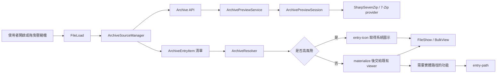

# 壓縮檔預覽機制

## 1. 文件目的

本文件說明壓縮檔瀏覽功能的架構、資料流、非同步生命週期、暫存檔策略，以及壓縮檔內高風險檔案的處理方式。內容以目前程式碼的實際行為為準，供日後維護、除錯與擴充時查閱。

壓縮檔瀏覽是唯讀的預覽模式。系統會先讀取壓縮檔目錄與檔案中繼資料，只有在某項功能確實需要實體檔案時，才會將安全的項目解壓縮到應用程式專用的暫存目錄。

## 2. 核心概念

### 2.1 壓縮檔是瀏覽來源，不是一般檔案路徑

壓縮檔模式中的項目不能直接當成 Windows 檔案系統路徑使用。壓縮檔內的路徑只是壓縮檔格式中的邏輯名稱，必須先透過後端 session 與 entry 身分解析或解壓縮，才能取得暫存檔路徑。

前端的 `FileRef` 分成兩種：

```ts
type FileRef =
  | { kind: "filesystem"; path: string }
  | {
      kind: "archive";
      archivePath: string;
      sessionId: string;
      entryId: number;
      logicalPath: string;
    };
```

- `filesystem.path`：真實存在於 Windows 檔案系統中的路徑。
- `archivePath`：來源壓縮檔的真實路徑。
- `sessionId + entryId`：目前 session 中壓縮檔項目的穩定身分。
- `logicalPath`：壓縮檔內的顯示路徑，只能用於顯示、排序與建立標籤。

`entryId` 是目前解壓縮 provider 使用的項目索引，只在所屬 `sessionId` 存活期間有效。不要以 `logicalPath` 作為項目的唯一鍵，也不要把它直接傳給 Windows API。

### 2.2 中繼資料與實體檔案分離

開啟壓縮檔時會先取得所有項目的中繼資料，包含名稱、大小、修改時間、是否為目錄與 `isHighRisk`。這個階段不會將每個項目解壓縮。

需要讀取檔案內容、產生一般縮圖、交給其他程式開啟或執行 Windows 檔案操作時，才進入 materialize 流程，將項目解壓縮到 session 專用的暫存目錄。

高風險項目不會進入 materialize 流程；它們使用檔案類型圖示作為預覽替代內容。

## 3. 整體架構與資料流



主要責任分界如下：

- 前端 `FileLoad`：決定是否進入壓縮檔模式、保存目前項目與模式狀態。
- 前端 `ArchiveSourceManager`：管理來源 session、開啟世代與合併後的項目清單。
- 前端 `ArchiveResolver`：將項目轉成預覽 URL、內容 URL、實體路徑 URL 或系統圖示 URL。
- 後端 `ArchivePreviewService`：管理 session、讀取項目中繼資料、排程解壓縮與暫存檔生命週期。
- `ArchivePreviewSession`：持有單一壓縮檔的 provider 與項目索引。
- `ArchiveHttpEndpoints`：提供前後端之間的 session、內容、路徑、縮圖與圖示 API。
- `FileShow`、`BulkView` 與既有 viewer：顯示已解壓縮的內容或高風險項目的替代圖示。

## 4. 支援格式與進入壓縮檔模式

前端會依副檔名判斷是否嘗試進入壓縮檔模式，目前支援：

`zip`、`rar`、`7z`、`cbz`、`cbr`、`xz`、`bz2`、`gz`、`tar`、`tgz`。

這個判斷只代表「嘗試使用壓縮檔流程」，不代表檔案內容一定有效。後端仍會透過檔案存在檢查、格式辨識與解壓縮 provider 驗證實際內容。

一般開啟流程如下：

1. `FileLoad.loadFile(path)` 判斷路徑是否為支援的壓縮檔副檔名。
2. 符合時呼叫 `loadArchiveFiles`，建立或切換壓縮檔來源。
3. 前端呼叫 `POST /api/archives/sessions/open`。
4. 後端建立 `ArchivePreviewSession`，回傳 session 與完整項目中繼資料。
5. 前端過濾目錄、保留檔案項目，依既有排序設定排序後建立清單。
6. 顯示第一個項目；高風險項目直接顯示圖示，其餘項目依需要解壓縮。

拖曳行為需要區分檔案數量：

- 單一檔案：交給 `loadFile`，因此單一壓縮檔可進入壓縮檔模式。
- 多個檔案或資料夾：走一般檔案瀏覽流程，不會把多個來源合併成一個壓縮檔 session。
- 在大量瀏覽模式中拖入單一壓縮檔：保留大量瀏覽狀態。高風險第一項也必須透過 `openBulkView` 顯示大量瀏覽工具列，而不能只開啟一般圖片檢視器。

壓縮檔開啟失敗時，回到歡迎頁並顯示對應錯誤訊息。這與「壓縮檔已成功開啟，但其中某一項無法解壓縮」是不同情境。

## 5. Session 生命週期

### 5.1 建立 session

`ArchivePreviewService.OpenAsync` 會先將來源路徑正規化並確認檔案存在，再建立來源快照。session 識別碼使用以下資料計算 SHA-256 後取前 10 個小寫字元：

```text
SHA256(fullPath + "|" + fileInfo.Length + "|" + fileInfo.LastWriteTimeUtc.Ticks)
```

這是快速指紋，不是完整檔案內容雜湊。它用來區分同一路徑在檔案大小或修改時間變更後的不同來源。

### 5.2 視窗擁有權與關閉

session 會記錄使用它的 `windowId`。同一 session 可能被多個視窗使用，但只有在以下條件都成立時才釋放 provider 與暫存檔：

- 沒有任何視窗擁有此 session。
- 沒有進行中的解壓縮或其他 provider 操作。

視窗關閉時由 `WebWindow.FormClosed` 直接呼叫 `CloseWindow(windowId)`，不可只依賴前端頁面是否仍在運作。前端切換來源時則呼叫 close/release，並清除目前的 archive state。

### 5.3 防止過期開啟結果覆蓋新來源

`ArchiveSourceManager` 使用 generation 管理非同步開啟流程。每次來源變更都會產生新的世代；舊世代的 API 回應即使較晚返回，也不能覆蓋目前清單或 session。

前端在使用項目時也會確認目前項目仍屬於目前 session。這是避免快速切換檔案、拖曳新來源或關閉視窗後，舊請求更新畫面的主要保護。

## 6. HTTP API

| 方法 | 路徑 | 是否解壓縮 | 用途 |
| --- | --- | --- | --- |
| `POST` | `/api/archives/sessions/open` | 否 | 建立 session 並取得項目中繼資料 |
| `DELETE` | `/api/archives/sessions/close` | 否 | 關閉指定 session 的視窗擁有權 |
| `GET` | `/api/archives/entry` | 是 | 取得項目內容，供文字、圖片、影片等 viewer 使用 |
| `GET` | `/api/archives/entry-path` | 是 | 取得項目的暫存實體路徑，供需要 Windows 路徑的功能使用 |
| `GET` | `/api/archives/entry-thumbnail` | 是 | 解壓縮後取得檔案縮圖或預設縮圖 |
| `GET` | `/api/archives/entry-icon` | 否 | 依高風險項目的安全副檔名取得系統圖示 |

失敗時 API 會回傳 JSON 錯誤，包含 `status`、`errorCode` 與 `message`。前端應依錯誤情境決定顯示一般載入失敗，或顯示「此類型的檔案不支援此操作」。

`entry-icon` 是高風險預覽的特例：它只能依中繼資料中的安全副檔名取得圖示，不可為了取得圖示而建立或讀取解壓縮後的暫存檔。

## 7. 解壓縮與暫存檔機制

### 7.1 唯一的 materialize 邊界

需要實體檔案的功能應統一經過 `QueueEntryAsync`。此方法負責：

1. 確認 entry 存在且不是目錄。
2. 若是高風險項目，立即以 `highRiskEntryBlocked` 拒絕，不接觸 provider，也不建立暫存檔。
3. 檢查加密或密碼需求。
4. 命中既有完整暫存檔時直接回傳。
5. 將相同 entry 的同時請求合併為同一個進行中工作。
6. 將工作交給排程器與解壓縮 worker。

任何新功能若需要壓縮檔內檔案的實體路徑，都應使用這個邊界，不可自行組合暫存路徑或直接呼叫 provider。

### 7.2 暫存檔安全性

暫存根目錄位於應用程式專用的 archive temp 目錄下，每個 session 使用獨立資料夾。完成檔案的檔名以 `entryId` 為主，並附加安全化後的副檔名；解壓縮中的內容先寫入 staging/partial 檔案，驗證成功後才改名為正式檔案。

解壓縮前後會檢查路徑正規化、目錄穿越、絕對路徑、無效檔名、大小寫不敏感衝突、長路徑與 reparse point 等情況。壓縮檔內的原始名稱不可直接決定暫存檔的實體位置。

### 7.3 排程與限制

目前重要限制如下：

| 項目 | 限制 |
| --- | ---: |
| 同時解壓縮 worker | 2 |
| Solid archive 進行完整解壓縮的大小門檻 | 10 MB |
| Solid archive 最大大小 | 100 MB |
| 單一項目大小達到此值即為高風險 | 1 GB |
| 單批次解壓縮總大小 | 1 GB |
| 單一 session 解壓縮總大小 | 10 GB |
| 單一壓縮檔項目數 | 100,000 |

Solid archive 可能需要以較大的範圍解壓縮才能取得單一項目，因此 scheduler 會依壓縮檔類型與待處理項目數量選擇單項、批次或完整解壓縮。高風險項目不會加入預取或解壓縮工作。

## 8. 高風險檔案政策

### 8.1 判斷規則

目前公開中繼資料只保留一個布林值：`isHighRisk`。不另外暴露 `extension`、`riskLevel` 或 `blockedReason`，因為副檔名可由路徑取得，而阻擋原因不是項目本身的穩定資料。

以下任一條件成立時，項目即為高風險：

- 副檔名符合後端 `ArchiveRiskPolicy` 的高風險清單。
- 項目大小大於或等於 1 GB。

目前清單涵蓋下列類別：

- 可執行檔與系統元件：`.exe`、`.dll`、`.sys`、`.scr`、`.cpl`、`.ocx`
- 安裝與套件：`.msi`、`.msix`、`.appx`、`.cab`、`.deb`、`.rpm`、`.nupkg` 等
- Script、捷徑與啟動器：`.bat`、`.cmd`、`.ps1`、`.vbs`、`.lnk`、`.url`
- 可能再次包含大量內容的容器或映像：`.zip`、`.rar`、`.7z`、`.tar`、`.gz`、`.bz2`、`.xz`、`.iso`、`.img`、`.wim`、`.vhd`、`.vhdx`、`.dmg`
- Java、行動平台與瀏覽器套件：`.jar`、`.war`、`.ear`、`.aar`、`.apk`、`.aab`、`.ipa`、`.xpi`、`.crx`、`.vsix`、`.whl`
- 大型模型與資料格式：`.safetensors`、`.ckpt`、`.pt`、`.pth`、`.onnx`、`.gguf`、`.ggml`、`.tflite`、`.pb`、`.h5`、`.hdf5`
- 資料庫與分析資料：`.db`、`.sqlite`、`.sqlite3`、`.mdb`、`.accdb`、`.parquet`、`.arrow`、`.feather`
- 編譯或原生模組：`.class`、`.pyc`、`.pyd`、`.so`、`.dylib`、`.elf`、`.wasm`
- Windows 套件集合：`.msixbundle`、`.appxbundle`、`.appinstaller`

### 8.2 高風險項目的預覽流程

高風險項目仍會出現在清單中，也可以被選取。選取後：

1. `ArchiveResolver.getThumbnailUrl` 改用 `/api/archives/entry-icon`。
2. 後端只使用項目中繼資料取得安全副檔名，再呼叫 `ImageProcessingService.GetFileIconByExtension`。
3. Windows Shell 透過 `IFileSystemBindData` 建立虛擬 Shell item，並以 `IShellItemImageFactory` 取得圖示；不會建立一個假的實體檔案，也不會解壓縮項目。
4. 前端建立只供顯示的 `FileInfo2`，其路徑標籤、檔案大小與修改日期都取自該 archive entry。
5. `FileShow.openIconImage` 或 `BulkView` 顯示圖示。
6. 這是正常預覽，不顯示 `error.svg`，也不顯示解壓縮錯誤訊息。

Windows 是否安裝能識別該副檔名的第三方程式，會影響 Shell 能取得的圖示。例如 `.apk` 若已被模擬器註冊，取得的可能是該程式註冊的 APK 圖示；若沒有註冊，則使用 Windows 可取得的預設圖示。這個行為由 Windows Shell 的檔案類型關聯決定。

### 8.3 高風險項目的操作限制

高風險項目不能被解壓縮成暫存檔，因此所有依賴實體路徑的功能都應拒絕，並顯示：

> 此類型的檔案不支援此操作

這包括快速拖曳、用其他程式開啟、列印、設為桌布、Windows 檔案操作、複製實體檔案等。這些功能透過 `ScriptOpen.resolvePhysicalPath` 或相同的 materialize 邊界收到 `highRiskEntryBlocked` 後處理。

複製「目前畫面上的影像」是例外。高風險預覽畫面已有圖示，因此 `ScriptCopy.copyImage` 會直接複製前端目前顯示的圖示影像，不要求建立暫存檔。這與複製壓縮檔內的原始檔案不同；後者仍屬於需要 materialize 的操作。

## 9. 前端顯示與功能分工

### 9.1 `FileLoad`

負責壓縮檔模式的進入、切換與目前項目狀態。它會保存 `_arArchiveItem`、`ArchiveSourceManager`、`ArchiveResolver` 與 `_isArchiveMode`，並依項目類型選擇一般 viewer、高風險圖示 viewer 或大量瀏覽模式。

高風險項目的 synthetic `FileInfo2` 必須保留：

- `FullPath`：邏輯上的壓縮檔/項目標籤。
- `Lenght`：該項目的實際大小。
- `LastWriteTimeUtc`：該項目的修改日期。
- `Path`：圖示 API URL，而非實體檔案路徑。

因此工具列不應顯示圖示替代檔或 `error.svg` 的檔案資訊。

### 9.2 `ArchiveSourceManager` 與 `ArchiveResolver`

`ArchiveSourceManager` 管理 session 與扁平化後的項目清單，並透過 generation 丟棄過期回應。`ArchiveResolver` 集中處理各種 URL 與項目身分轉換，避免不同功能自行拼接 `sessionId`、`entryId` 或暫存路徑。

### 9.3 `FileShow`、`MainExif` 與 `BulkView`

- `FileShow` 顯示單一項目的內容或系統圖示，並使用 synthetic metadata 初始化工具列。
- `MainExif` 在壓縮檔模式中隱藏「相關檔案」頁籤；若目前正停在該頁籤，切回資訊頁。
- `BulkView` 對一般項目使用 materialize 後的內容；對高風險項目直接使用圖示 URL，不呼叫 `getImgData`，並保留正確的大小與修改日期。
- 一般安全項目解壓縮失敗時才使用 `error.svg`，並顯示一般載入失敗訊息。高風險項目不應走這條錯誤 fallback。

## 10. 功能行為對照

| 功能 | 一般安全項目 | 高風險項目 |
| --- | --- | --- |
| 清單顯示 | 顯示項目資訊 | 顯示項目資訊與系統圖示 |
| 單項預覽 | 必要時解壓縮後交給 viewer | 直接顯示系統圖示 |
| 大小、日期、類型 | 使用 entry 中繼資料 | 使用 entry 中繼資料 |
| 一般縮圖 | `entry-thumbnail`，需要解壓縮 | 不使用，改用 `entry-icon` |
| 文字或圖片內容 | `entry`，需要解壓縮 | 不支援 |
| 快速拖曳 | `entry-path` 取得暫存路徑 | 顯示不支援訊息 |
| 用其他程式開啟 | `entry-path` 取得暫存路徑 | 顯示不支援訊息 |
| 複製顯示中的影像 | 依既有 viewer 流程 | 直接複製畫面上的圖示 |
| 複製原始檔案 | 需要解壓縮 | 不支援 |
| 相關檔案 | 壓縮檔模式隱藏 | 壓縮檔模式隱藏 |

## 11. 非同步與並行安全

維護非同步流程時必須注意以下規則：

- 前端來源切換必須增加 generation，舊請求不能更新新來源的 UI。
- session 關閉不可在仍有 provider 操作時釋放 extractor。
- 同一 entry 的同時 materialize 請求應共用 in-flight task，避免重複解壓縮。
- SharpSevenZip 的單一 extractor 操作由 `_extractorGate` 序列化；跨 session 的工作由全域 worker pool 限制並行數。
- 取消或替換壓縮檔載入時，密碼輸入 Promise 必須先 settle，否則可能造成下一次載入永久等待。
- 高風險項目不應加入預取、批次解壓縮或一般縮圖工作。
- archive mode 中的邏輯身分要一直保留到操作完成；只有在明確需要 Windows API 時，才解析成實體暫存路徑。

## 12. 安全與路徑規則

壓縮檔項目名稱來自外部輸入，所有後端路徑處理都必須遵守：

- 先正規化，再檢查是否為絕對路徑或包含目錄穿越。
- 不允許項目名稱將輸出導向 session 暫存目錄以外。
- 不直接使用原始項目名稱作為唯一實體檔名。
- 處理大小寫不敏感的檔名衝突與不合法 Windows 檔名。
- 寫入 staging/partial 檔後，要完成大小與內容狀態驗證，才可成為可供前端使用的正式暫存檔。
- 不把 archive 的 `logicalPath`、URL 標籤或組合字串當成 Windows API 的實體路徑。

## 13. 維護注意事項

1. 新增需要實體路徑的功能時，先確認它是否會經過 `QueueEntryAsync`；若會，必須處理 `highRiskEntryBlocked`。
2. 新增高風險副檔名時，優先修改後端 `ArchiveRiskPolicy`，並確認前端只依 `isHighRisk` 顯示，不要重新建立一份風險判斷清單。
3. 不要為了取得高風險項目的圖示而建立虛擬實體檔案或解壓縮；圖示流程必須維持非 materialize。
4. 不要把高風險預覽當成載入錯誤。只有安全項目的 materialize 失敗才使用 `error.svg` 與一般載入錯誤訊息。
5. 若修改 archive mode 的載入流程，必須同時檢查一般檢視、大量瀏覽、拖曳進入與第一項為高風險的情境。
6. 若修改項目 metadata 或 synthetic `FileInfo2`，必須確認工具列的檔案類型、大小、修改日期仍來自 archive entry。
7. 壓縮檔模式目前是唯讀預覽；重新命名、刪除、移動、儲存回原檔與檔案監看等一般檔案功能不應直接套用。
8. session 指紋不是完整內容雜湊。若需求是偵測檔案內容在大小與修改時間不變時的變更，必須另行設計內容驗證成本與快取策略。

## 14. 主要相關檔案

### 後端

- `Tiefsee/Features/Archive/Application/ArchivePreviewModels.cs`：session、項目 metadata 與 `isHighRisk` 模型。
- `Tiefsee/Features/Archive/Application/ArchivePreviewService.cs`：session、provider、materialize、cache、限制與排程。
- `Tiefsee/Features/Archive/Http/ArchiveHttpEndpoints.cs`：壓縮檔 HTTP API。
- `Tiefsee/Features/Image/Application/ImageProcessingService.cs`：依副檔名取得 Windows 圖示的服務邊界。
- `Tiefsee/Infrastructure/Vendor/WindowsThumbnailProvider.cs`：Windows Shell 虛擬項目與圖示取得。

