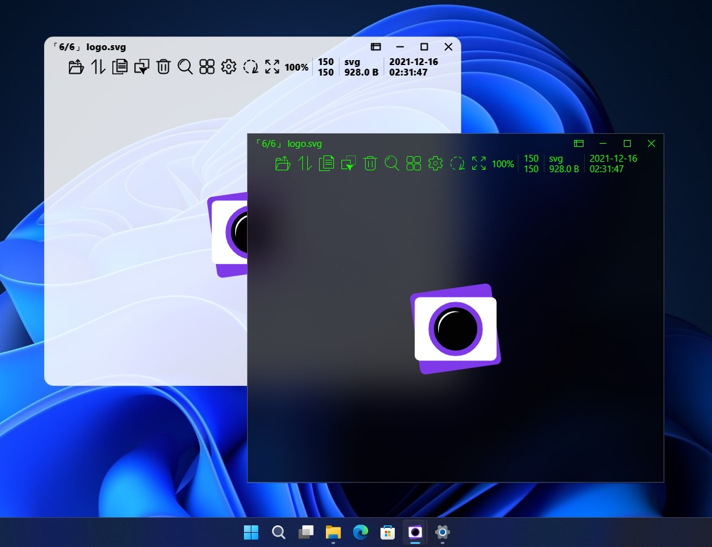
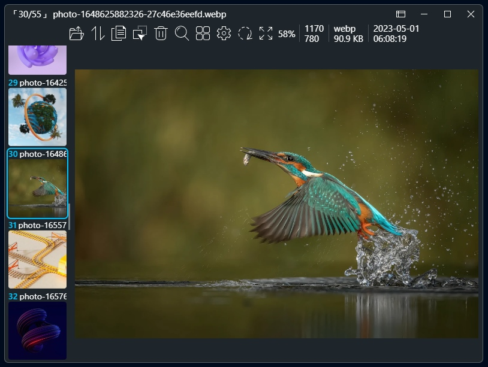
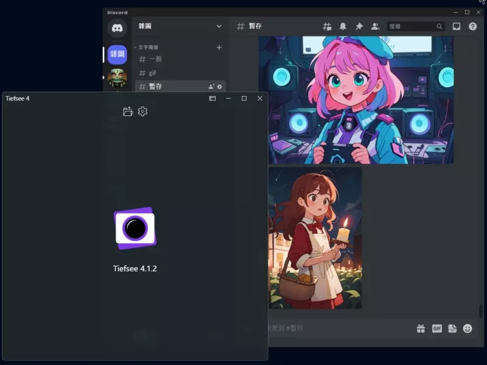

English | [中文](README.zh_TW.md)

<h1 align="center">
Tiefsee
</h1>

An open-source image viewer for Windows with powerful features and ease of use

Website：<a href="https://hbl917070.github.io/aeropic/en/">hbl917070.github.io/aeropic</a>

 

## Download

> System requirements: 64-bit Windows 10 or Windows 11

### Current version：Tiefsee 4.2.7

 - 

 - Download [Portable version](https://github.com/hbl917070/Tiefsee4/releases)

 

## Introduction

 - Quick start: Tiefsee can be opened quickly as long as Tiefsee is not completely closed.
 - Quick Drag File: Drag and drop pictures directly to other programs for opening or uploading.
 - Open Web Image: You can drag and drop images from your browser directly into Tiefsee to open it.
 - Online image search: support sauceNAO, Yandex, Ascii2d, Google, Google Lens, Bing.
 - File Panel: Preview the pictures in the same folder.
 - Directory Panel: Show the list of folders and preview the pictures in the folders.
 - Information Panel: EXIF information, location where the picture was taken, AI drawing prompt (A1111, NovelAI, ComfyUI, InvokeAI).
 - Bulk View：Load multiple pictures at once and view them in a vertical scrolling manner.
 - QuickLook: Long press on the spacebar to preview the file selected on the desktop or in the folder.
 - Other additional features: PDF reader, MD editor, text file editor, docx and pptx readers.
 - Supported Languages: English、中文

 

## FAQ

### 1、What is the difference between the Store and Portable versions?

 - There is no functional difference between the Store and Portable versions
 - The Store version can be updated through the store and will not leave any data after Tiefsee is deleted
 - The Portable version requires the installation of [.NET Desktop Runtime 8 (x64)](https://dotnet.microsoft.com/en-us/download/dotnet/8.0) to run
 - The Portable version can use 'portable mode' by creating a `PortableMode` folder next to Tiefsee.exe, and all data will be stored inside

> If there are no special requirements, it is recommended to use the Store version

 

### 2、Why is the Store version larger than the Portable version?
The Store version packages the entire .NET runtime environment into the program during compilation, and Microsoft has not yet proposed an effective solution

 

### 3、Program displays `WebView2 must be installed to run this application` when starting
Possible reasons are:
 - WebView2 is not installed on the computer:「<a href="https://go.microsoft.com/fwlink/p/?LinkId=2124703">Click here</a>」 to download
 - WebView2 is installed but failed to install: Remove the old WebView2, then right-click on 'WebView2 installer' and run as administrator
 - WebView2 initialization error: Avoid special characters such as Chinese, Japanese, and Korean in the Tiefsee path

 

## Project Description
- Project Type: C# WinForm (.NET 8)
- Development Language：C#、TypeScript
- [Project Build Steps](Building.md)

 

## Licenses

The Tiefsee4 project is open source under the [MIT license](/LICENSE). 
However, the extensions that are installed separately are not part of the Tiefsee4 project. 
They all have their own licenses!
